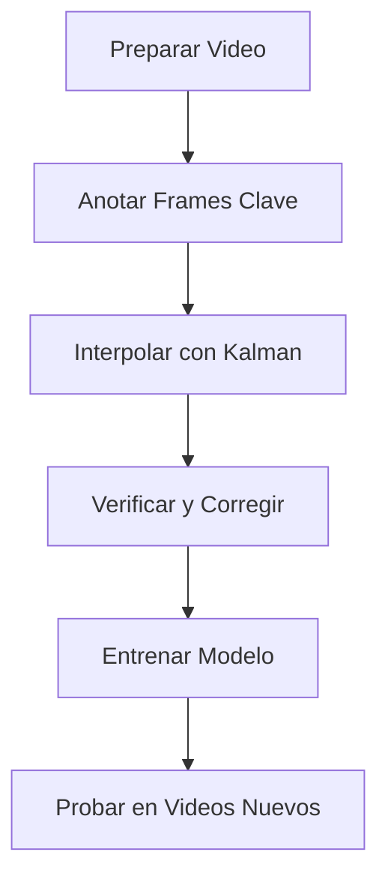

# 📝 Guía Completa de Anotación de Videos de Baloncesto

Esta guía te enseña cómo anotar tus propios videos de baloncesto para entrenar un modelo personalizado de detección del balón.

## 📑 Tabla de Contenidos

1. [Introducción](#introducción)
2. [Preparación del Video](#preparación-del-video)
3. [Métodos de Anotación](#métodos-de-anotación)
4. [Anotación Manual con la Herramienta Incluida](#anotación-manual-con-la-herramienta-incluida)
5. [Anotación Profesional con Roboflow](#anotación-profesional-con-roboflow)
6. [Mejores Prácticas](#mejores-prácticas)
7. [Solución de Problemas](#solución-de-problemas)
8. [Flujo de Trabajo Completo](#flujo-de-trabajo-completo)

---

## Introducción

La anotación de videos es el proceso de marcar la posición del balón en cada frame del video. Esto crea datos de entrenamiento que el modelo de inteligencia artificial usa para aprender a detectar el balón automáticamente.

### ¿Por qué anotar tus propios videos?

- ✅ **Mayor precisión** para tus videos específicos
- ✅ **Adaptación** a diferentes condiciones de iluminación y ángulos
- ✅ **Personalización** para tu tipo de contenido (partido completo, highlights, entrenamientos)
- ✅ **Control total** sobre la calidad de los datos de entrenamiento

---

## Preparación del Video

### 1. Requisitos del Video

**Formato recomendado:**
- Formato: MP4 (preferible), AVI, MOV
- Resolución: 720p o superior (1080p ideal)
- FPS: 30 fps o superior
- Duración: 30 segundos a 5 minutos por video (para empezar)
- Iluminación: Buena iluminación, evitar contraluces extremos

**Consejos de calidad:**
```
✅ Bueno:
   • Balón visible la mayor parte del tiempo
   • Iluminación uniforme
   • Ángulo de cámara estable (sin movimientos bruscos)
   • Balón claramente distinguible del fondo

❌ Evitar:
   • Videos muy borrosos o con baja resolución
   • Balón oculto la mayor parte del tiempo
   • Iluminación muy pobre
   • Videos extremadamente largos (dividir en segmentos)
```

### 2. Organizar tus Videos

Coloca tus videos en la carpeta correspondiente:

```bash
basketball_tracker/
├── data/
│   └── raw/                    # 📹 Coloca tus videos aquí
│       ├── video1.mp4
│       ├── video2.mp4
│       └── entrenamiento1.mp4
```

**Ejemplo de organización:**
```bash
mkdir -p data/raw
cp /ruta/a/tu/video.mp4 data/raw/partido_01.mp4
```

---

## Métodos de Anotación

Hay tres métodos principales para anotar videos:

| Método | Pros | Contras | Recomendado Para |
|--------|------|---------|------------------|
| **Herramienta Incluida** | Gratis, funciona offline, integrada | Manual, más lento | Principiantes, pocos videos |
| **Roboflow** | Interfaz profesional, auto-labeling | Requiere cuenta, online | Proyectos serios, muchos videos |
| **CVAT** | Open-source, potente | Configuración compleja | Usuarios avanzados |

---

## Anotación Manual con la Herramienta Incluida

Esta herramienta viene incluida en el proyecto y permite anotar videos de forma interactiva.

### Paso 1: Iniciar la Herramienta de Anotación

```bash
python -c "from src.modules.annotator import BallAnnotator; \
           annotator = BallAnnotator(
               video='data/raw/video1.mp4',
               output='data/annotations/video1.json'
           ); \
           annotator.run()"
```

**O crear un script personalizado:**

```python
# scripts/annotate_my_video.py
from src.modules.annotator import BallAnnotator

annotator = BallAnnotator(
    video="data/raw/mi_video.mp4",
    output="data/annotations/mi_video.json"
)
annotator.run()
```

### Paso 2: Usar la Interfaz de Anotación

#### Controles de Teclado:

| Tecla | Acción |
|-------|--------|
| **Click Izquierdo** | Marcar posición del balón |
| **Arrastrar** | Ajustar posición marcada |
| **A** | Frame anterior |
| **D** | Frame siguiente |
| **S** | Guardar anotaciones |
| **Q** | Salir (guardar automáticamente) |
| **Espacio** | Saltar al siguiente frame sin anotar |

#### Flujo de Trabajo:

1. **Marcar frames clave:**
   - No necesitas anotar cada frame
   - Marca cada 10-30 frames dependiendo de la velocidad del balón
   - Prioriza momentos importantes (tiros, pases, rebotes)

2. **Ser preciso:**
   - Haz click en el centro exacto del balón
   - Si no estás seguro, es mejor saltarse ese frame

3. **Guardar frecuentemente:**
   - Presiona 'S' cada 50-100 anotaciones
   - El progreso se guarda automáticamente al salir

### Paso 3: Verificar Anotaciones

Las anotaciones se guardan en formato JSON:

```json
{
  "0": {"center": [640, 360], "radius": 12},
  "30": {"center": [600, 380], "radius": 13},
  "60": {"center": [580, 400], "radius": 14}
}
```

**Verificar cantidad de anotaciones:**
```bash
python -c "import json; data = json.load(open('data/annotations/video1.json')); print(f'Frames anotados: {len(data)}')"
```

### Paso 4: Interpolar con Kalman Filter

El filtro de Kalman rellena automáticamente los frames intermedios:

```python
from src.modules.trajectory_detector import process_trajectory_video

detections = process_trajectory_video(
    video_path="data/raw/video1.mp4",
    annotations_path="data/annotations/video1.json",
    output_path="data/detections/video1.json"
)
```

**Esto creará detecciones suavizadas para todos los frames intermedios.**

### Paso 5: Verificar y Corregir

Usa la herramienta de verificación para revisar y corregir detecciones:

```python
from src.modules.verifier import CompactBallVerifier

verifier = CompactBallVerifier(
    video_path="data/raw/video1.mp4",
    detection_file="data/detections/video1.json",
    output_file="data/verified/video1.json"
)
verifier.run()
```

#### Controles del Verificador:

| Tecla | Acción |
|-------|--------|
| **Click** | Ajustar detección |
| **A/D** | Frame anterior/siguiente |
| **+/-** | Aumentar/reducir radio |
| **T** | Toggle vista de trayectoria |
| **P/N** | Anomalía anterior/siguiente |
| **H** | Ocultar/mostrar detección |
| **S** | Guardar |
| **Q** | Salir |

---

## Anotación Profesional con Roboflow

Roboflow es una plataforma profesional que facilita la anotación y gestión de datasets.

### Paso 1: Crear Cuenta en Roboflow

1. Ve a [https://roboflow.com/](https://roboflow.com/)
2. Crea una cuenta gratuita
3. Obtén tu API key: Settings → API Keys → Private API Key

### Paso 2: Extraer Frames del Video

Primero, extrae frames del video para anotar:

```python
# scripts/extract_frames_for_annotation.py
import cv2
import os

def extract_frames(video_path, output_dir, frame_interval=10):
    """
    Extrae frames de un video para anotación.

    Args:
        video_path: Path al video
        output_dir: Directorio de salida
        frame_interval: Extraer un frame cada N frames
    """
    os.makedirs(output_dir, exist_ok=True)

    cap = cv2.VideoCapture(video_path)
    frame_count = 0
    saved_count = 0

    while True:
        ret, frame = cap.read()
        if not ret:
            break

        if frame_count % frame_interval == 0:
            output_path = os.path.join(output_dir, f"frame_{frame_count:06d}.jpg")
            cv2.imwrite(output_path, frame)
            saved_count += 1

        frame_count += 1

    cap.release()
    print(f"✓ Extraídos {saved_count} frames de {frame_count} totales")

# Uso
extract_frames(
    video_path="data/raw/video1.mp4",
    output_dir="data/frames_to_annotate/video1",
    frame_interval=10  # Un frame cada 10
)
```

**Ejecutar:**
```bash
python scripts/extract_frames_for_annotation.py
```

### Paso 3: Subir a Roboflow

1. **Crear Proyecto:**
   - En Roboflow, crea un nuevo proyecto
   - Tipo: Object Detection
   - Categoría: Sports
   - Clase: basketball

2. **Subir Imágenes:**
   - Arrastra las imágenes extraídas a Roboflow
   - O usa el API:

```python
from roboflow import Roboflow

rf = Roboflow(api_key="TU_API_KEY")
project = rf.workspace().project("tu-proyecto")

# Subir imágenes
project.upload(
    image_path="data/frames_to_annotate/video1",
    num_workers=10
)
```

### Paso 4: Anotar en Roboflow

1. **Manual:**
   - Selecciona cada imagen
   - Dibuja bounding boxes alrededor del balón
   - Etiqueta como "basketball"

2. **Con Auto-Labeling (Smart Polygon):**
   - Roboflow puede detectar automáticamente objetos
   - Revisa y corrige las anotaciones

3. **Con Model-Assisted Labeling:**
   - Usa un modelo pre-entrenado para pre-anotar
   - Corriges manualmente si es necesario

### Paso 5: Generar Dataset

1. **Configurar Aumentaciones:**
   ```yaml
   Preprocessing:
     - Auto-Orient
     - Resize: 640x640

   Augmentation:
     - Flip: Horizontal
     - Rotation: ±15°
     - Brightness: ±20%
     - Blur: Up to 2px
   ```

2. **Generar Versión:**
   - Train/Valid/Test split: 70/20/10
   - Generar dataset

3. **Descargar:**
   - Formato: YOLOv8
   - Descargar ZIP

### Paso 6: Integrar con el Proyecto

**Opción A: Descarga manual**
```bash
# Extraer en el directorio correcto
unzip roboflow-basketball.zip -d data/basketball_training/roboflow_dataset
```

**Opción B: Usar script de descarga**
```bash
python scripts/download_roboflow_dataset.py \
    --api-key TU_API_KEY \
    --workspace tu-workspace \
    --project tu-proyecto \
    --version 1
```

---

## Mejores Prácticas

### 🎯 Estrategia de Anotación

#### 1. **Cantidad vs Calidad**

**Para empezar (modelo básico):**
- 200-500 frames anotados por video
- 2-3 videos diferentes
- Total: ~1000 anotaciones

**Para modelo profesional:**
- 1000-2000 frames por video
- 5-10 videos variados
- Total: 5000-10000 anotaciones

#### 2. **Diversidad**

Anota videos con:
- ✅ Diferentes ángulos de cámara
- ✅ Diferentes iluminaciones (día, noche, interior)
- ✅ Diferentes distancias de la cámara
- ✅ Diferentes tipos de juego (partido, entrenamiento, ejercicios)
- ✅ Diferentes fondos y escenarios

#### 3. **Frames Clave**

Prioriza estos momentos:
- 🎯 Tiros al aro
- 🏃 Pases entre jugadores
- 🤾 Rebotes
- ⛹️ Dribbling activo
- 🌟 Balón en el aire (trayectorias)

### ✅ Checklist de Calidad

Antes de entrenar, verifica:

```
□ Al menos 500 frames anotados por video
□ Anotaciones en todo el video (inicio, medio, fin)
□ Balón visible en las anotaciones (no oculto)
□ Centro del balón marcado con precisión
□ Diferentes escenarios cubiertos
□ Verificación completada sin anomalías
□ Datos guardados en data/verified/
```

### 📊 Métricas de Calidad

Evalúa tus anotaciones:

```python
# scripts/evaluate_annotations.py
import json

def evaluate_annotations(annotation_file):
    with open(annotation_file) as f:
        data = json.load(f)

    total_frames = len(data)

    # Verificar calidad
    issues = 0
    for frame, annot in data.items():
        center = annot.get('center', [0, 0])
        radius = annot.get('radius', 0)

        # Verificar valores válidos
        if center[0] <= 0 or center[1] <= 0:
            issues += 1
        if radius < 5 or radius > 100:
            issues += 1

    quality_score = ((total_frames - issues) / total_frames) * 100

    print(f"📊 Calidad de Anotaciones:")
    print(f"   Total frames: {total_frames}")
    print(f"   Problemas encontrados: {issues}")
    print(f"   Score de calidad: {quality_score:.1f}%")

    if quality_score >= 95:
        print("   ✅ Excelente calidad")
    elif quality_score >= 85:
        print("   ✓ Buena calidad")
    else:
        print("   ⚠️ Revisar anotaciones")

# Uso
evaluate_annotations("data/verified/video1.json")
```

---

## Solución de Problemas

### ❌ "Cannot open video"

**Problema:** El video no se puede abrir

**Soluciones:**
```bash
# Verificar que el archivo existe
ls -lh data/raw/video1.mp4

# Verificar formato del video
ffprobe data/raw/video1.mp4

# Convertir a MP4 si es necesario
ffmpeg -i video_original.avi -c:v libx264 -c:a aac data/raw/video1.mp4
```

### ❌ "Anotaciones imprecisas"

**Problema:** El modelo no aprende bien

**Soluciones:**
1. **Revisar precisión:**
   - Usa el verificador para revisar todas las anotaciones
   - Corrige frames con detecciones incorrectas

2. **Aumentar cantidad:**
   - Anota más frames (objetivo: 1000+ por video)
   - Añade más videos variados

3. **Mejorar diversidad:**
   - Incluye diferentes ángulos y condiciones
   - Prioriza frames difíciles (balón parcialmente oculto, rápido movimiento)

### ❌ "Trayectorias con saltos"

**Problema:** El Kalman filter genera trayectorias poco naturales

**Soluciones:**
```python
# Ajustar parámetros del Kalman filter
from src.modules.trajectory_detector import process_trajectory_video

detections = process_trajectory_video(
    video_path="data/raw/video1.mp4",
    annotations_path="data/annotations/video1.json",
    output_path="data/detections/video1.json",
    # Ajustes personalizados
    process_noise=0.01,    # Reducir para trayectorias más suaves
    measurement_noise=5.0   # Reducir para confiar más en las mediciones
)
```

### ❌ "Error al guardar anotaciones"

**Problema:** No se puede guardar el archivo JSON

**Soluciones:**
```bash
# Verificar permisos
chmod 755 data/annotations/

# Crear directorios si no existen
mkdir -p data/annotations
mkdir -p data/detections
mkdir -p data/verified

# Verificar espacio en disco
df -h
```

---

## Flujo de Trabajo Completo

### 📋 Resumen del Proceso



### 🚀 Script Completo de Anotación

```python
#!/usr/bin/env python3
"""
Script completo para anotar un video desde cero hasta modelo entrenado.
"""

from src.modules.annotator import BallAnnotator
from src.modules.trajectory_detector import process_trajectory_video
from src.modules.verifier import CompactBallVerifier
from src.modules.yolo_trainer import UltraYOLOBallTrainer

def annotate_and_train(video_path, video_name):
    """
    Pipeline completo de anotación y entrenamiento.

    Args:
        video_path: Path al video
        video_name: Nombre para los archivos
    """
    print(f"🎬 Procesando: {video_name}")

    # Paths
    annotations_path = f"data/annotations/{video_name}.json"
    detections_path = f"data/detections/{video_name}.json"
    verified_path = f"data/verified/{video_name}.json"
    model_dir = f"models/trained/{video_name}_detector"

    # 1. Anotación manual
    print("\n[1/5] Anotación manual...")
    annotator = BallAnnotator(video=video_path, output=annotations_path)
    annotator.run()

    # 2. Interpolación con Kalman
    print("\n[2/5] Interpolación con Kalman...")
    process_trajectory_video(
        video_path=video_path,
        annotations_path=annotations_path,
        output_path=detections_path
    )

    # 3. Verificación
    print("\n[3/5] Verificación...")
    verifier = CompactBallVerifier(
        video_path=video_path,
        detection_file=detections_path,
        output_file=verified_path
    )
    verifier.run()

    # 4. Entrenamiento
    print("\n[4/5] Entrenamiento del modelo...")
    trainer = UltraYOLOBallTrainer(
        video_path=video_path,
        annotations=verified_path,
        output_dir=model_dir,
        model="yolo11l.pt"
    )
    trainer.train(epochs=50, batch_size=16, img_size=640)

    # 5. Prueba
    print("\n[5/5] Probando modelo...")
    UltraYOLOBallTrainer.detect(
        video_path=video_path,
        model_path=f"{model_dir}/weights/best.pt",
        output_path=f"outputs/{video_name}_detected.mp4",
        conf=0.5
    )

    print("\n✅ ¡Proceso completo!")
    print(f"   Modelo: {model_dir}/weights/best.pt")
    print(f"   Video de prueba: outputs/{video_name}_detected.mp4")

# Uso
if __name__ == "__main__":
    annotate_and_train(
        video_path="data/raw/mi_video.mp4",
        video_name="mi_video"
    )
```

### 📝 Checklist Final

Antes de entrenar tu modelo:

```
□ Video en data/raw/ (MP4, buena calidad)
□ Anotaciones manuales completadas (200-500 frames)
□ Interpolación con Kalman ejecutada
□ Verificación completada sin anomalías mayores
□ Archivos guardados en data/verified/
□ Al menos 1000+ frames anotados totales
□ Diversidad de escenarios cubierta
```

---

## 📚 Recursos Adicionales

### Herramientas Recomendadas

1. **Roboflow:** [https://roboflow.com/](https://roboflow.com/)
   - Anotación profesional
   - Auto-labeling
   - Augmentations

2. **CVAT:** [https://github.com/opencv/cvat](https://github.com/opencv/cvat)
   - Open-source
   - Auto-tracking
   - Colaborativo

3. **Label Studio:** [https://labelstud.io/](https://labelstud.io/)
   - Open-source
   - Múltiples formatos
   - ML-assisted labeling

### Tutoriales

- [Roboflow Tutorial](https://blog.roboflow.com/getting-started-with-roboflow/)
- [YOLO Annotation Guide](https://docs.ultralytics.com/datasets/detect/)
- [Basketball Detection Best Practices](https://blog.roboflow.com/basketball-detection/)

### Datasets Públicos

Para complementar tus anotaciones:
- [Roboflow Basketball Detection](https://universe.roboflow.com/roboflow-100/basketball-detection)
- [Basketball Object Detection](https://universe.roboflow.com/search?q=basketball)

---

## 🎯 Siguientes Pasos

Después de anotar tus videos:

1. **Entrenar modelo:**
   ```bash
   python scripts/train_basketball_detector_simple.py
   ```

2. **Probar modelo:**
   ```bash
   python scripts/test_basketball_model.py
   ```

3. **Usar en producción:**
   ```bash
   python scripts/pipeline.py --video nuevo_video.mp4
   ```

---

## 💡 Consejos Finales

- 🎯 **Empieza pequeño:** Anota 1-2 videos bien antes de escalar
- 🔄 **Itera:** Entrena, prueba, mejora anotaciones, re-entrena
- 📊 **Mide:** Evalúa el modelo con métricas (mAP, precisión, recall)
- 🚀 **Escala:** Una vez que funciona, añade más datos
- 🤝 **Comparte:** Publica tu dataset en Roboflow Universe

---

**¿Preguntas o problemas?** Abre un issue en GitHub o consulta la documentación adicional.

**Última actualización:** Noviembre 2024
